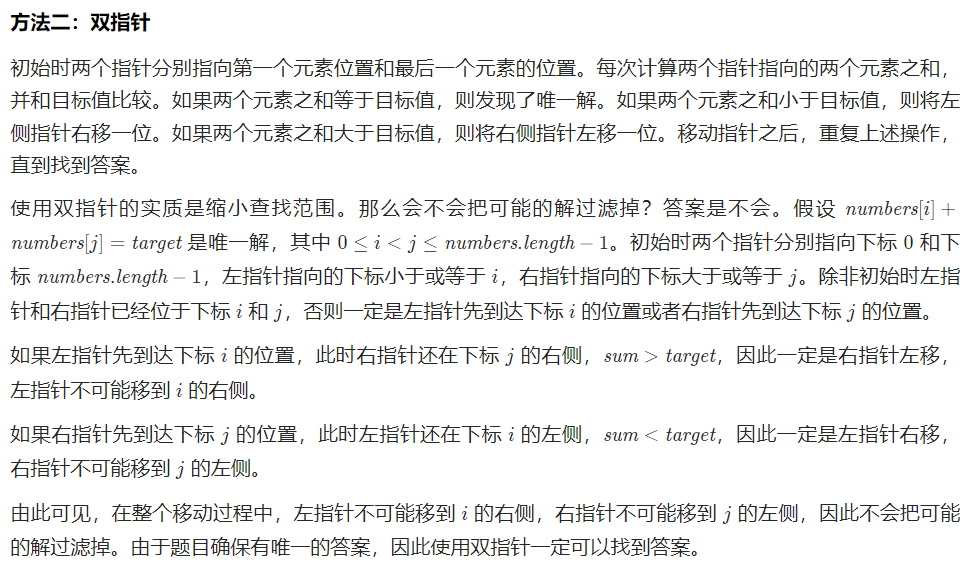

# leetcode 剑指 offer

[29. Divide Two Integers](#29)

[67. Add Binary](#67)

[338. Counting Bits](#338)

[137. Single Number II](#137)

[318. Maximum Product of Word Lengths](#318)

[167. Two Sum II - Input Array Is Sorted](#167)

[209. Minimum Size Subarray Sum](#209)
&nbsp;

# demo

&nbsp;

<!-- from here -->

## 167. Two Sum II - Input Array Is Sorted <a id="167"></a>

<p><strong>solution : </strong></p>

```Java

```

<p><strong>TC : O(1) --> Max 32 bit</strong></p>
<p><strong>SC : O(1)</strong></p>

&nbsp;

<!-- to here -->

# algorithm

## 29. Divide Two Integers <a id="29"></a>

<div class="notranslate">
    <p>Given two integers 
        <code>dividend</code> and <code>divisor</code>, divide two integers <strong>without</strong> using multiplication, division, and mod operator.
    </p>
    <p>The integer division should truncate toward zero, which means losing its fractional part. For example, <code>8.345</code> would be truncated to <code>8</code>, and <code>-2.7335</code> would be truncated to <code>-2</code>.</p>
    <p>Return <em>the <strong>quotient</strong> after dividing </em><code>dividend</code><em> by </em><code>divisor</code>.</p>
    <p><strong>Note: </strong>Assume we are dealing with an environment that could only store integers within the <strong>32-bit</strong> signed integer range: <code>[−2<sup>31</sup>, 2<sup>31</sup> − 1]</code>. For this problem, if the quotient is <strong>strictly greater than</strong> <code>2<sup>31</sup> - 1</code>, then return <code>2<sup>31</sup> - 1</code>, and if the quotient is <strong>strictly less than</strong> <code>-2<sup>31</sup></code>, then return <code>-2<sup>31</sup></code>.</p>
    <p>&nbsp;</p>
    <p><strong>Example 1:</strong></p>
    <pre><strong>Input:</strong> dividend = 10, divisor = 3
    <strong>Output:</strong> 3
    <strong>Explanation:</strong> 10/3 = 3.33333.. which is truncated to 3.
    </pre>
    <p><strong>Example 2:</strong></p>
    <pre><strong>Input:</strong> dividend = 7, divisor = -3
    <strong>Output:</strong> -2
    <strong>Explanation:</strong> 7/-3 = -2.33333.. which is truncated to -2.
    </pre>
    <p>&nbsp;</p>
    <p><strong>Constraints:</strong></p>
    <ul>
        <li><code>-2<sup>31</sup> &lt;= dividend, divisor &lt;= 2<sup>31</sup> - 1</code></li>
        <li><code>divisor != 0</code></li>
    </ul>
</div>
<p>solution : use bit operation to solve this problem 利用位运算实现除法</p>


```Java
class Solution {
    public int divide(int a, int b) {
        // corner case int overflow (此时会出现int溢出的情况)
        if (a == Integer.MIN_VALUE && b == -1) {
            return Integer.MAX_VALUE;
        }
        // no need to calculate
        if (a == 0 || b == 1) {
            return a;
        } else if (b == -1) {
            return -a;
        }
        // judge the result
        boolean neg = false;
        if ((a > 0 && b < 0) || (a < 0 && b > 0)) {
            neg = true;
        }
        // since use positive number may cause int overflow, we use the negative number instead.
        int num = 0;
        int res = -Math.abs(a);
        b = -Math.abs(b);
        int shift = getMaxShift(res, b);
        while (res <= b) {
            while (res > (b << shift)) {
                shift--;
            }
            num += (1 << shift);
            res -= (b << shift);
        }
        return neg == false ? num : -num;
    }
    private int getMaxShift(int res, int b) {
        int shift = 0;
        while (res <= b) {
            res >>= 1;
            shift++;
        }
        return shift - 1;
    }
}
```

<p><strong>TC : O(1) --> Max 32 bit</strong></p>
<p><strong>SC : O(1)</strong></p>

&nbsp;

## 67. Add Binary <a id="67"></a>

### (new Method: StringBuilder.insert(index, value))

<div class="notranslate">
    <p>Given two binary strings <code>a</code> and <code>b</code>, return <em>their sum as a binary string</em>.</p>
    <p><strong>Example 1:</strong></p>
    <pre><strong>Input:</strong> a = "11", b = "1"
    <strong>Output:</strong> "100"
    </pre><p><strong>Example 2:</strong></p>
    <pre><strong>Input:</strong> a = "1010", b = "1011"
    <strong>Output:</strong> "10101"
    </pre>
    <p>&nbsp;</p>
    <p><strong>Constraints:</strong></p>
    <ul>
        <li><code>1 &lt;= a.length, b.length &lt;= 10<sup>4</sup></code></li>
        <li><code>a</code> and <code>b</code> consist&nbsp;only of <code>'0'</code> or <code>'1'</code> characters.</li>
        <li>Each string does not contain leading zeros except for the zero itself.</li>
    </ul>
</div>

<p><strong>solution1 : it is like the add two linked list, use StringBuilder to save the result</strong></p>

```Java
class Solution {
    public String addBinary(String a, String b) {
        StringBuilder sb = new StringBuilder();
        int i = a.length() - 1;
        int j = b.length() - 1;
        int carry = 0;

        while (i >= 0 || j >= 0) {
            int num = 0;
            if (i >= 0) {
                num += (a.charAt(i--) - 48);
            }
            if (j >= 0) {
                num += (b.charAt(j--) - 48);
            }
            num += carry;
            carry = num / 2;
            num %= 2;
            // use inset here we do not need to reverse the string
            sb.insert(0, (char)(num + 48));
        }
        if (carry == 1) {
            sb.insert(0, '1');
        }
        // if use sb.append, we need to reverse
        // return sb.reverse().toString();
        return sb.toString();
    }
}
```

<p><strong>TC : O(n) --> n is the max length of a or b</strong></p>
<p><strong>SC : O(1) extra space</strong></p>

<p><strong>solution2 : use bit operation to do this</strong></p>
TODO

&nbsp;

## 338. Counting Bits <a id="338"></a>

<div class="notranslate"><p>Given an integer <code>n</code>, return <em>an array </em><code>ans</code><em> of length </em><code>n + 1</code><em> such that for each </em><code>i</code><em> </em>(<code>0 &lt;= i &lt;= n</code>)<em>, </em><code>ans[i]</code><em> is the <strong>number of </strong></em><code>1</code><em><strong>'s</strong> in the binary representation of </em><code>i</code>.</p>

<p>&nbsp;</p>
<p><strong>Example 1:</strong></p>

<pre><strong>Input:</strong> n = 2
<strong>Output:</strong> [0,1,1]
<strong>Explanation:</strong>
0 --&gt; 0
1 --&gt; 1
2 --&gt; 10
</pre>

<p><strong>Example 2:</strong></p>

<pre><strong>Input:</strong> n = 5
<strong>Output:</strong> [0,1,1,2,1,2]
<strong>Explanation:</strong>
0 --&gt; 0
1 --&gt; 1
2 --&gt; 10
3 --&gt; 11
4 --&gt; 100
5 --&gt; 101
</pre>

<p>&nbsp;</p>
<p><strong>Constraints:</strong></p>

<ul>
	<li><code>0 &lt;= n &lt;= 10<sup>5</sup></code></li>
</ul>

<p>&nbsp;</p>
<p><strong>Follow up:</strong></p>

<ul>
	<li>It is very easy to come up with a solution with a runtime of <code>O(n log n)</code>. Can you do it in linear time <code>O(n)</code> and possibly in a single pass?</li>
	<li>Can you do it without using any built-in function (i.e., like <code>__builtin_popcount</code> in C++)?</li>
</ul>
</div>

<!-- solu 1 -->

## solution1 : Brian Kernighan x=x & (x−1) to set last 1 to 0

<p>Repeat until X == 0</p>

```Java
class Solution {
    public int[] countBits(int n) {
        int[] bits = new int[n + 1];
        for (int i = 0; i <= n; i++) {
            bits[i] = countOnes(i);
        }
        return bits;
    }

    public int countOnes(int x) {
        int ones = 0;
        while (x > 0) {
            x &= (x - 1);
            ones++;
        }
        return ones;
    }
}
```

<p><strong>TC : O(nlogn) --> n numbers/ each logn to traverse</strong></p>
<p><strong>SC : O(1)</strong></p>

<!-- solu 2 -->

## solution2 : Dynamic programming

<p><strong>y is 2^n when y & (y - 1) = 0</strong></p>
<p><strong>bits[i] = bits[i - highBit] + 1;</strong></p>

```Java
class Solution {
    public int[] countBits(int n) {
        int[] bits = new int[n + 1];
        int highBit = 0;
        for (int i = 1; i <= n; i++) {
            if ((i & (i - 1)) == 0) {
                highBit = i;
            }
            bits[i] = bits[i - highBit] + 1;
        }
        return bits;
    }
}
```

<p><strong>TC : O(n) --> n numbers/ each O(1)</strong></p>
<p><strong>SC : O(1)</strong></p>

&nbsp;

## 137. Single Number II <a id="137"></a>

<div class="notranslate"><p>Given an integer array <code>nums</code> where&nbsp;every element appears <strong>three times</strong> except for one, which appears <strong>exactly once</strong>. <em>Find the single element and return it</em>.</p>

<p>You must&nbsp;implement a solution with a linear runtime complexity and use&nbsp;only constant&nbsp;extra space.</p>

<p>&nbsp;</p>
<p><strong>Example 1:</strong></p>
<pre><strong>Input:</strong> nums = [2,2,3,2]
<strong>Output:</strong> 3
</pre><p><strong>Example 2:</strong></p>
<pre><strong>Input:</strong> nums = [0,1,0,1,0,1,99]
<strong>Output:</strong> 99
</pre>
<p>&nbsp;</p>
<p><strong>Constraints:</strong></p>

<ul>
	<li><code>1 &lt;= nums.length &lt;= 3 * 10<sup>4</sup></code></li>
	<li><code>-2<sup>31</sup> &lt;= nums[i] &lt;= 2<sup>31</sup> - 1</code></li>
	<li>Each element in <code>nums</code> appears exactly <strong>three times</strong> except for one element which appears <strong>once</strong>.</li>
</ul>
</div>

<p><strong>Solution1: use hashmap with SC: O(nlogn)</strong></p>

<p><strong>Solution2: use bit operation to solve this problem 利用位运算实现除法</strong></p>

```Java
/*
Any bit of the sum of three same number %3 == 0. So we can find for bit i, if the X % 3 != 0, that's the bit of the number we want.
*/
class Solution {
    public int singleNumber(int[] nums) {
        int ans = 0;
        for (int i = 0; i < 32; ++i) {
            int total = 0;
            for (int num: nums) {
                total += ((num >> i) & 1);
            }
            if (total % 3 != 0) {
                ans |= (1 << i);
            }
        }
        return ans;
    }
}
```

<p><strong>TC : O(n * logC) -->C Max 32 bit</strong></p>
<p><strong>SC : O(1)</strong></p>

&nbsp;

## 318. Maximum Product of Word Lengths <a id="318"></a>

<div class="notranslate"><p>Given a string array <code>words</code>, return <em>the maximum value of</em> <code>length(word[i]) * length(word[j])</code> <em>where the two words do not share common letters</em>. If no such two words exist, return <code>0</code>.</p>

<p>&nbsp;</p>
<p><strong>Example 1:</strong></p>

<pre><strong>Input:</strong> words = ["abcw","baz","foo","bar","xtfn","abcdef"]
<strong>Output:</strong> 16
<strong>Explanation:</strong> The two words can be "abcw", "xtfn".
</pre>

<p><strong>Example 2:</strong></p>

<pre><strong>Input:</strong> words = ["a","ab","abc","d","cd","bcd","abcd"]
<strong>Output:</strong> 4
<strong>Explanation:</strong> The two words can be "ab", "cd".
</pre>

<p><strong>Example 3:</strong></p>

<pre><strong>Input:</strong> words = ["a","aa","aaa","aaaa"]
<strong>Output:</strong> 0
<strong>Explanation:</strong> No such pair of words.
</pre>

<p>&nbsp;</p>
<p><strong>Constraints:</strong></p>

<ul>
	<li><code>2 &lt;= words.length &lt;= 1000</code></li>
	<li><code>1 &lt;= words[i].length &lt;= 1000</code></li>
	<li><code>words[i]</code> consists only of lowercase English letters.</li>
</ul>
</div>

<p><strong>Solution : bit operation</strong></p>


```Java
class Solution {
    public int maxProduct(String[] words) {
        int length = words.length;
        int[] masks = new int[length];
        for (int i = 0; i < length; i++) {
            String word = words[i];
            int wordLength = word.length();
            for (int j = 0; j < wordLength; j++) {
                masks[i] |= 1 << (word.charAt(j) - 'a');
            }
        }
        int maxProd = 0;
        for (int i = 0; i < length; i++) {
            for (int j = i + 1; j < length; j++) {
                if ((masks[i] & masks[j]) == 0) {
                    maxProd = Math.max(maxProd, words[i].length() * words[j].length());
                }
            }
        }
        return maxProd;
    }
}
```

<p><strong>TC : O(n^2) --> combination of each word is n^2 and O(1) to check if there is an overlap character</strong></p>
<p><strong>SC : O(n) --> bitmask array</strong></p>

&nbsp;

## 167. Two Sum II - Input Array Is Sorted <a id="167"></a>

<div class="notranslate"><p>Given a <strong>1-indexed</strong> array of integers <code>numbers</code> that is already <strong><em>sorted in non-decreasing order</em></strong>, find two numbers such that they add up to a specific <code>target</code> number. Let these two numbers be <code>numbers[index<sub>1</sub>]</code> and <code>numbers[index<sub>2</sub>]</code> where <code>1 &lt;= index<sub>1</sub> &lt; index<sub>2</sub> &lt;= numbers.length</code>.</p>

<p>Return<em> the indices of the two numbers, </em><code>index<sub>1</sub></code><em> and </em><code>index<sub>2</sub></code><em>, <strong>added by one</strong> as an integer array </em><code>[index<sub>1</sub>, index<sub>2</sub>]</code><em> of length 2.</em></p>

<p>The tests are generated such that there is <strong>exactly one solution</strong>. You <strong>may not</strong> use the same element twice.</p>

<p>Your solution must use only constant extra space.</p>

<p>&nbsp;</p>
<p><strong>Example 1:</strong></p>

<pre><strong>Input:</strong> numbers = [<u>2</u>,<u>7</u>,11,15], target = 9
<strong>Output:</strong> [1,2]
<strong>Explanation:</strong> The sum of 2 and 7 is 9. Therefore, index<sub>1</sub> = 1, index<sub>2</sub> = 2. We return [1, 2].
</pre>

<p><strong>Example 2:</strong></p>

<pre><strong>Input:</strong> numbers = [<u>2</u>,3,<u>4</u>], target = 6
<strong>Output:</strong> [1,3]
<strong>Explanation:</strong> The sum of 2 and 4 is 6. Therefore index<sub>1</sub> = 1, index<sub>2</sub> = 3. We return [1, 3].
</pre>

<p><strong>Example 3:</strong></p>

<pre><strong>Input:</strong> numbers = [<u>-1</u>,<u>0</u>], target = -1
<strong>Output:</strong> [1,2]
<strong>Explanation:</strong> The sum of -1 and 0 is -1. Therefore index<sub>1</sub> = 1, index<sub>2</sub> = 2. We return [1, 2].
</pre>

<p>&nbsp;</p>
<p><strong>Constraints:</strong></p>

<ul>
	<li><code>2 &lt;= numbers.length &lt;= 3 * 10<sup>4</sup></code></li>
	<li><code>-1000 &lt;= numbers[i] &lt;= 1000</code></li>
	<li><code>numbers</code> is sorted in <strong>non-decreasing order</strong>.</li>
	<li><code>-1000 &lt;= target &lt;= 1000</code></li>
	<li>The tests are generated such that there is <strong>exactly one solution</strong>.</li>
</ul>
</div>

<p><strong>Solution : use two pointer to solve this problem; Notice that the given array is already sorted. If unsorted, we can use hashMap to solve this problem with TC O(n) and SC O(n)</strong></p>



```Java
class Solution {
    public int[] twoSum(int[] numbers, int target) {
        int low = 0, high = numbers.length - 1;
        while (low < high) {
            int sum = numbers[low] + numbers[high];
            if (sum == target) {
                return new int[]{low + 1, high + 1};
            } else if (sum < target) {
                ++low;
            } else {
                --high;
            }
        }
        return new int[]{-1, -1};
    }
}
```

<p><strong>TC : O(n) --> from border to center</strong></p>
<p><strong>SC : O(1)</strong></p>

&nbsp;

## 209. Minimum Size Subarray Sum <a id="209"></a>

<div class="notranslate"><p>Given an array of positive integers <code>nums</code> and a positive integer <code>target</code>, return the minimal length of a <strong>contiguous subarray</strong> <code>[nums<sub>l</sub>, nums<sub>l+1</sub>, ..., nums<sub>r-1</sub>, nums<sub>r</sub>]</code> of which the sum is greater than or equal to <code>target</code>. If there is no such subarray, return <code>0</code> instead.</p>

<p>&nbsp;</p>
<p><strong>Example 1:</strong></p>

<pre><strong>Input:</strong> target = 7, nums = [2,3,1,2,4,3]
<strong>Output:</strong> 2
<strong>Explanation:</strong> The subarray [4,3] has the minimal length under the problem constraint.
</pre>

<p><strong>Example 2:</strong></p>

<pre><strong>Input:</strong> target = 4, nums = [1,4,4]
<strong>Output:</strong> 1
</pre>

<p><strong>Example 3:</strong></p>

<pre><strong>Input:</strong> target = 11, nums = [1,1,1,1,1,1,1,1]
<strong>Output:</strong> 0
</pre>

<p>&nbsp;</p>
<p><strong>Constraints:</strong></p>

<ul>
	<li><code>1 &lt;= target &lt;= 10<sup>9</sup></code></li>
	<li><code>1 &lt;= nums.length &lt;= 10<sup>5</sup></code></li>
	<li><code>1 &lt;= nums[i] &lt;= 10<sup>4</sup></code></li>
</ul>

<p>&nbsp;</p>
<strong>Follow up:</strong> If you have figured out the <code>O(n)</code> solution, try coding another solution of which the time complexity is <code>O(n log(n))</code>.</div>

<p>solution : use sliding window to slove this problem</p>

```Java
class Solution {
    /*
    maintain a sliding window [i, j] and record the sum of this interval
    while (sum >= target):
        update minLength
        i++ (reduce the window length)
    */
    public int minSubArrayLen(int target, int[] nums) {
        if (nums.length == 0) return 0;
        int minLen = Integer.MAX_VALUE;
        int i = 0;
        int sum = 0;
        for (int j = 0; j < nums.length; j++){
            sum += nums[j];
            while (sum >= target) {
                minLen = Math.min(minLen, j - i + 1);
                sum -= nums[i++];
            }
        }
        return minLen == Integer.MAX_VALUE ? 0 : minLen;
    }
}
```

<p><strong>TC : O(n) --> linear scan</strong></p>
<p><strong>SC : O(1) const extra space</strong></p>

&nbsp;
